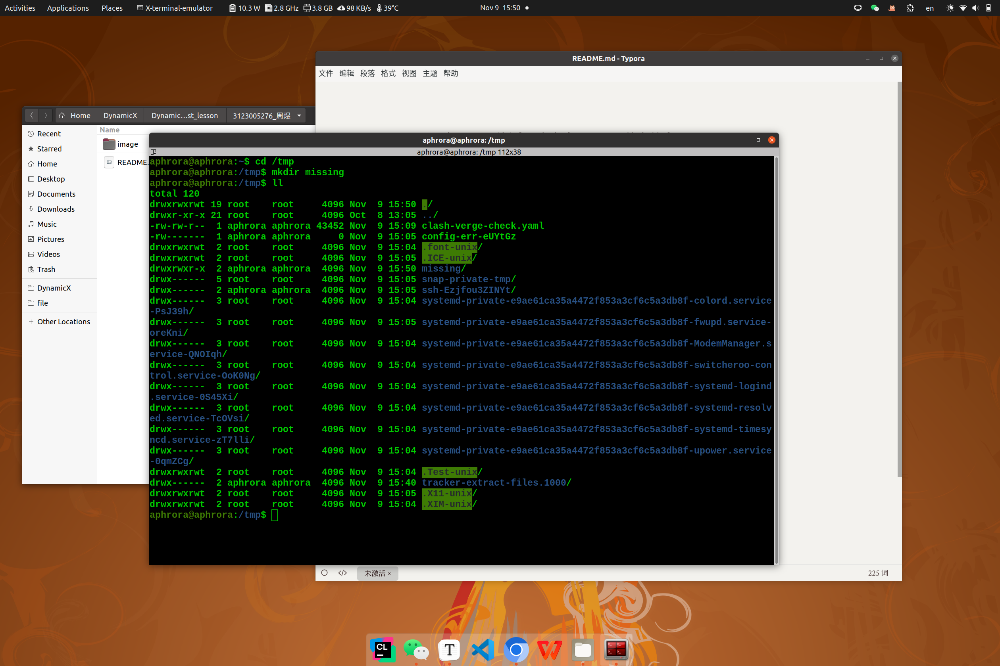
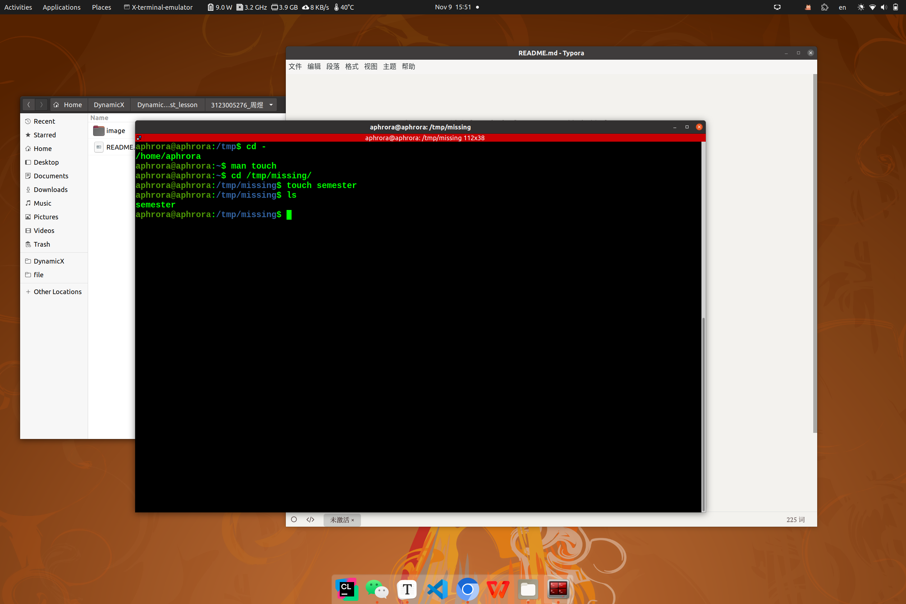
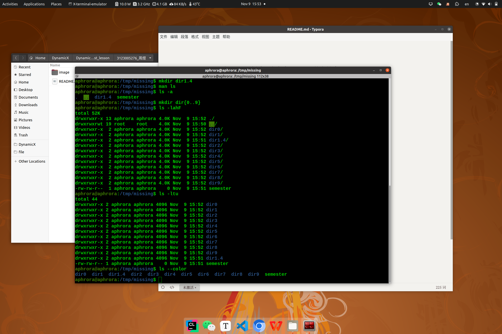
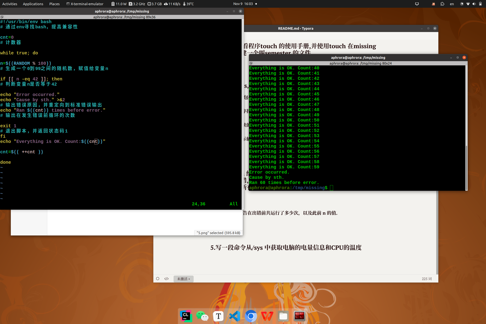
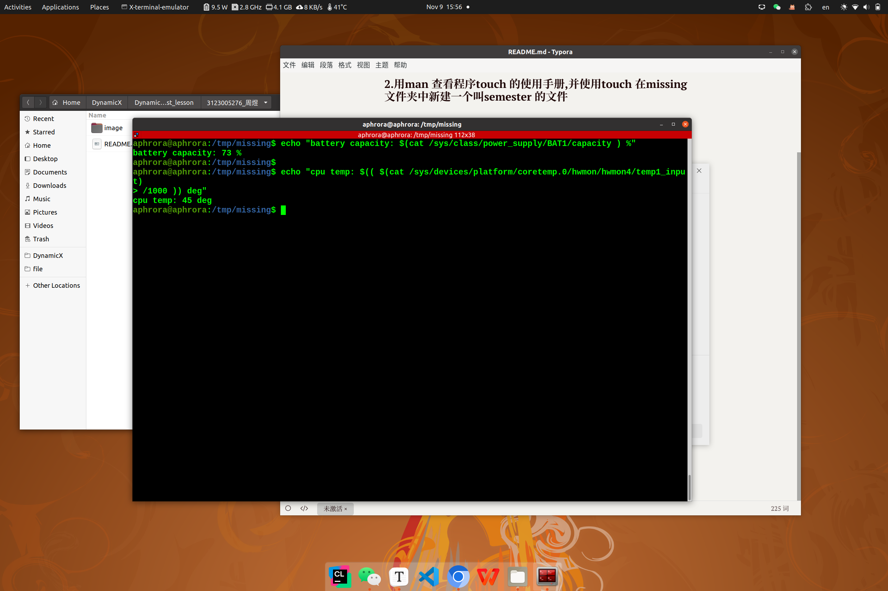

## 1.在/tmp 下新建一个名为missing 的文件夹

## 2.用man 查看程序touch 的使用手册,并使用touch 在missing 文件夹中新建一个叫semester 的文件

## 3.阅读man ls,然后使用ls 命令进行如下操作:

##### --打印所有文件(包括隐藏文件)

##### --以最近访问顺序排序

##### --以方便人类阅读的格式输出

##### --以彩色文本显示输出结果

## 4．使用 vim 给 semester 文件编写下方脚本，功能为：运行它直到它出错，将它的标准输出和标准错误流记录到文件，并在最后输出所有内容．

##### 一有必要的注释

##### ﹣出错后能够报告在出错前共运行了多少次，以及此前 n 的值．

## 5.写一段命令从/sys 中获取电脑的电量信息和CPU的温度

